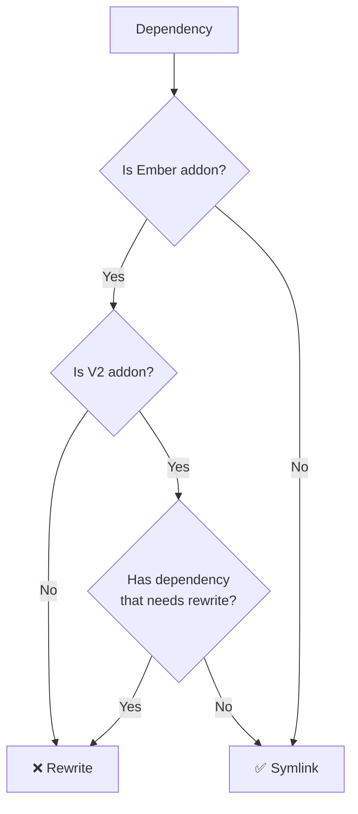

# Embroider Architecture Overview (extremely WIP)


## Summary
What is Embroider? Why do we care about Embroider? What is Embroider trying to fix? How does Embroider work?

This is an attempt at distilling the research @22a and myself have been doing the past while into something that's consumable and answers these questions. Or, at the very least, documents what we think we understand so we can iterate on it later.

## Let's start at the goal
Before we can talk about what Embroider is and how it works, it’s useful to talk about our end goal and why that is not currently possible with Ember apps and the build tools, specifically EmberCLI, we use today.

In modern times, a javascript application is made up of a number of javascript files that reference each other via imports. Each of these files is an ECMAScript Module (ESM for short) and they are referenced using the ESM `import` specifier. For example:

```js
// src/full-name.js

export default function fullName(first, last) {
  return `${first} ${last}`;
}
```

```js
// src/main.js

import fullName from ‘./full-name’;

fullName(‘Bob’, ‘Marley”);
```

As you can see, `src/full-name.js` exports a function and `src/main.js` imports that function for use. This reference between the two files creates a “module graph” whereby, starting at `src/main.js` we can follow the imports and find our way through the graph to `src/full-name.js`.

Generally, with a modern JS build tool, such as Webpack, we can point the tool at a project directory, tell it the “entrypoint” - the file to start at - and it will crawl the files it finds and build up the module graph of dependencies. Typically this entry point might be an `index.html` file. For example:

Given this file structure:

```bash
/
├── index.html
└── src
    ├── main.js
    └── full-name.js
```

The index.html might look like this:

```html
<!DOCTYPE html>
<html>
  <head>
    <meta charset="utf-8" />
  </head>
  <body>
    <script src="src/main.js"></script>
  </body>
</html>
```

Pointing the build tool to this `index.html`, it will see that we have a script tag pointing to `src/main.js`. It will load that file and detect the imports in it and follow them through, building the graph. Which, for examples sake, would look like this:

```bash
index.html
└── src/main.js
    └── src/full-name.js
```

It is because of this graph traversal that modern build tools are able to do things like detect when modules are not used in the code and therefore, not include them in the final production asset build.

So, in this perfect world, we can just point our modern JS build tool at our project directory that uses modern ESM syntax and it is able to traverse the dependency graph.

However, unfortunately, an Ember application of today doesn't work like this. Ember currently relies on many special build rules that come from EmberCLI which means that in many ways it does not explicitly define the dependencies that are used in an app. In order to understand what things need to change in an Ember app to allow us to run a modern build tool against it, let's look at some of the reasons why it doesn't currently work today.

So, the ultimate goal of Embroider is to be able to point a modern JS build tool at your real Ember app folder, instead of a version of it that has been copied to a tmp directory.

## The App

As it stands, a very basic Ember app might look like this (for simplicity, let's ignore things likes `/tests` and `/styles`):

```bash
/
├── app
│   ├── index.html
│   ├── app.js
│   ├── components
│   │   ├── user-card.js
│   │   └── user-card.hbs
│   └── templates
│       └── application.hbs
├── ember-cli-build.js
└── package.json
```

If we look at the `index.html` file, we can quickly see why pointing a modern build tool at it won't work.

```html
<!DOCTYPE html>
<html>
  <head>
    <meta charset="utf-8" />
    <link rel="stylesheet" href="/assets/vendor.css" />
    <link rel="stylesheet" href="/assets/my-app.css" />
  </head>
  <body>
    <script src="/assets/vendor.js"></script>
    <script src="/assets/my-app.js"></script>
  </body>
</html>
```

Unlike the "perfect world" example above, this `index.html` points to `.js` and `.css` files that don't actually exist. This is because the are pointing to files in a location that will be created as a part of the EmberCLI build logic that runs when we run the `ember build` command. Let's look a bit deeper to see what else we can find.

## The Addons
**TODO**

## Embroider Build Stages

### Stage 1 - Compat Addons

This stage is all about ensuring our Ember addon dependencies conform to the V2 Package Format ([RFC](https://rfcs.emberjs.com/id/0507-embroider-v2-package-format/)). This stage goes through each of the EmberApp's dependencies, and their dependencies to check if they need to be re-written to the V2 Package format. Because the addons can't be modified in place, in the project's `node_modules` folder, they are written to a tmp Embroider directory. So, Embroider effectively recreates the `node_modules` directory in this tmp dir. For dependencies that do need to be converted to V2, it creates a new copy of the dependency. For those that do not need any modification, they are symlinked in to the tmp dir.

The following checks determine if a dependency does not need to be rewritten:

- The dependency is not an Ember addon
- The dependency is a V2 Ember addon _and_ none of its own dependencies need to be rewritten

The following checks determine if a dependency does need to be rewritten:

- The dependency is a V1 Ember addon or;
- The dependency is a V2 Ember addon but one or more of it's dependencies must be rewritten (ie, are a V1 addon)

Or, put another way, as a picture:



The output of stage 1 is a tmp embroider directory containing a `node_modules` directory with a mix of symlinked node modules for packages that were no rewritten and rewritten packages for those that were convereted to V2 (or one of their dependencies was converted) , something like this for example:

```bash
ae4d3a
└── node_modules
    ├── @ember
    │   ├── optional-features
    │   │   ├── node_modules
    │   │   │   ├── chalk -> /Users/aaron/src/scratchpad/with-embroider/node_modules/@ember/optional-features/node_modules/chalk
    │   │   │   ├── ember-cli-version-checker -> /Users/aaron/src/scratchpad/with-embroider/node_modules/ember-cli-version-checker
    │   │   │   ├── glob -> /Users/aaron/src/scratchpad/with-embroider/node_modules/glob
    │   │   │   ├── inquirer -> /Users/aaron/src/scratchpad/with-embroider/node_modules/inquirer
    │   │   │   ├── mkdirp -> /Users/aaron/src/scratchpad/with-embroider/node_modules/@ember/optional-features/node_modules/mkdirp
    │   │   │   └── silent-error -> /Users/aaron/src/scratchpad/with-embroider/node_modules/silent-error
    │   │   └── package.json
    │   ├── string
    │   │   ├── cache.js
    │   │   ├── index.js
    │   │   └── package.json
    ├── @embroider
    │   ├── compat -> /Users/aaron/src/scratchpad/with-embroider/node_modules/@embroider/compat
    │   ├── core -> /Users/aaron/src/scratchpad/with-embroider/node_modules/@embroider/core
    │   ├── macros
    │   │   ├── es-compat.js
    │   │   ├── node_modules
    │   │   │   ├── @embroider
    │   │   │   │   └── shared-internals -> /Users/aaron/src/scratchpad/with-embroider/node_modules/@embroider/shared-internals
    │   │   │   ├── assert-never -> /Users/aaron/src/scratchpad/with-embroider/node_modules/assert-never
    │   │   │   ├── babel-import-util -> /Users/aaron/src/scratchpad/with-embroider/node_modules/babel-import-util
    │   │   │   ├── find-up -> /Users/aaron/src/scratchpad/with-embroider/node_modules/find-up
    │   │   │   ├── lodash -> /Users/aaron/src/scratchpad/with-embroider/node_modules/lodash
    │   │   │   ├── resolve -> /Users/aaron/src/scratchpad/with-embroider/node_modules/resolve
    │   │   │   └── semver -> /Users/aaron/src/scratchpad/with-embroider/node_modules/semver
    │   │   ├── package.json
    │   │   ├── runtime.js
    │   │   └── vendor
    │   │       └── embroider-macros-test-support.js
    ├── babel-eslint -> /Users/aaron/src/scratchpad/with-embroider/node_modules/babel-eslint
    ├── broccoli-asset-rev
    │   ├── node_modules
    │   │   ├── broccoli-asset-rewrite -> /Users/aaron/src/scratchpad/with-embroider/node_modules/broccoli-asset-rewrite
    │   │   ├── broccoli-filter -> /Users/aaron/src/scratchpad/with-embroider/node_modules/broccoli-filter
    │   │   ├── broccoli-persistent-filter -> /Users/aaron/src/scratchpad/with-embroider/node_modules/broccoli-asset-rev/node_modules/broccoli-persistent-filter
    │   │   ├── json-stable-stringify -> /Users/aaron/src/scratchpad/with-embroider/node_modules/json-stable-stringify
    │   │   ├── minimatch -> /Users/aaron/src/scratchpad/with-embroider/node_modules/minimatch
    │   │   └── rsvp -> /Users/aaron/src/scratchpad/with-embroider/node_modules/broccoli-asset-rev/node_modules/rsvp
    │   └── package.json
    ├── ember-cli-app-version
    │   ├── _app_
    │   │   ├── helpers
    │   │   │   └── app-version.js
    │   │   └── initializers
    │   │       └── app-version.js
    │   ├── initializer-factory.js
    │   ├── node_modules
    │   │   └── git-repo-info -> /Users/aaron/src/scratchpad/with-embroider/node_modules/git-repo-info
    │   ├── package.json
    │   └── utils
    │       └── regexp.js
    ├── ember-cli-dependency-checker
    │   ├── node_modules
    │   │   ├── chalk -> /Users/aaron/src/scratchpad/with-embroider/node_modules/chalk
    │   │   ├── ember-cli -> /Users/aaron/src/scratchpad/with-embroider/node_modules/ember-cli
    │   │   ├── find-yarn-workspace-root -> /Users/aaron/src/scratchpad/with-embroider/node_modules/find-yarn-workspace-root
    │   │   ├── is-git-url -> /Users/aaron/src/scratchpad/with-embroider/node_modules/is-git-url
    │   │   ├── resolve -> /Users/aaron/src/scratchpad/with-embroider/node_modules/resolve
    │   │   └── semver -> /Users/aaron/src/scratchpad/with-embroider/node_modules/ember-cli-dependency-checker/node_modules/semver
    │   └── package.json
    ├── ember-inflector
    │   ├── _app_
    │   │   └── helpers
    │   │       ├── pluralize.js
    │   │       └── singularize.js
    │   ├── index.js
    │   ├── lib
    │   │   ├── helpers
    │   │   │   ├── pluralize.js
    │   │   │   └── singularize.js
    │   │   ├── system
    │   │   │   ├── inflections.js
    │   │   │   ├── inflector.js
    │   │   │   └── string.js
    │   │   ├── system.js
    │   │   └── utils
    │   │       └── make-helper.js
    │   └── package.json
    ├── ember-page-title
    │   ├── _app_
    │   │   ├── helpers
    │   │   │   └── page-title.js
    │   │   └── services
    │   │       ├── page-title-list.js
    │   │       └── page-title.js
    │   ├── helpers
    │   │   └── page-title.js
    │   ├── package.json
    │   ├── services
    │   │   ├── page-title-list.js
    │   │   └── page-title.js
    │   └── test-support
    │       ├── get-page-title.js
    │       └── index.js
    ├── ember-template-lint -> /Users/aaron/src/scratchpad/with-embroider/node_modules/ember-template-lint
    ├── ember-welcome-page -> /Users/aaron/src/scratchpad/with-embroider/node_modules/ember-welcome-page
    ├── eslint -> /Users/aaron/src/scratchpad/with-embroider/node_modules/eslint
    ├── eslint-config-prettier -> /Users/aaron/src/scratchpad/with-embroider/node_modules/eslint-config-prettier
    ├── eslint-plugin-ember -> /Users/aaron/src/scratchpad/with-embroider/node_modules/eslint-plugin-ember
    ├── eslint-plugin-node -> /Users/aaron/src/scratchpad/with-embroider/node_modules/eslint-plugin-node
    ├── eslint-plugin-prettier -> /Users/aaron/src/scratchpad/with-embroider/node_modules/eslint-plugin-prettier
    ├── eslint-plugin-qunit -> /Users/aaron/src/scratchpad/with-embroider/node_modules/eslint-plugin-qunit
    ├── loader.js
    │   ├── package.json
    │   └── vendor
    │       └── loader
    │           ├── loader.instrument.js
    │           └── loader.js
    ├── npm-run-all -> /Users/aaron/src/scratchpad/with-embroider/node_modules/npm-run-all
    ├── prettier -> /Users/aaron/src/scratchpad/with-embroider/node_modules/prettier
    ├── qunit -> /Users/aaron/src/scratchpad/with-embroider/node_modules/qunit
    ├── qunit-dom
    │   ├── index.js
    │   ├── index.js.map
    │   ├── node_modules
    │   │   ├── broccoli-funnel -> /Users/aaron/src/scratchpad/with-embroider/node_modules/broccoli-funnel
    │   │   ├── broccoli-merge-trees -> /Users/aaron/src/scratchpad/with-embroider/node_modules/broccoli-merge-trees
    │   │   └── ember-cli-version-checker -> /Users/aaron/src/scratchpad/with-embroider/node_modules/ember-cli-version-checker
    │   └── package.json
    └── webpack -> /Users/aaron/src/scratchpad/with-embroider/node_modules/webpack
```

### Stage 2 - Compat App

Stage two is about rewriting elements of the Ember app itself to be consumable by the final stage build tool. As it is on disk there are numerous elements to an Ember app that are not understandable to modern build tools. Some of these things are:

- The entrypoint (`index.html`) points to JS and CSS files that do not exist until after the EmberCLI build
- An Ember app can reference components and other objects that come from dependent Ember addons _magically_ by virtue of the fact they exist in a specific directory in the addon package (**QUESTION** Is this handled by stage 1 or by stage 3? where are these things "merged" in to the Ember app's tree?)
- The app's `config/environment.js` is generated based on the flags passed in to the build command, generally (but not always) the `envrionment` flag.
- **QUESTION** Something about assets here???
- Handlebars templates need to be compiled out to JS. **QUESTION** Not really clear on where this actually happens. Is this a part of stage 3? Or somewhere else. This is always going to need to happen so where does it and where will it happen?
- I can't really think what else makes sense here. The output of stage two is a slightly changed a round project folder. **QUESTION** What else goes here?

**QUESTION** Does it make sense to put something here about how stage 2 gathers the `appJS`, `html`, `public` and `config` trees to gether and merges them in to the tmp dir?

The final output of stage 2 is a version of our Ember app that we can point our JS build tool at, for example, Webpack. It looks something like this:

```bash
ae4d3a
├── _babel_config_.js
├── _babel_filter_.js
├── app.js
├── assets
│   ├── test-support.css
│   ├── test-support.css.map
│   ├── test-support.js
│   ├── test-support.map
│   ├── test.js
│   ├── vendor.js
│   ├── vendor.map
│   ├── with-embroider.css
│   └── with-embroider.js
├── components
│   ├── bacon.hbs
│   └── bacon.js
├── config
│   └── environment.js
├── controllers
├── ember-welcome-page
│   └── images
├── helpers
├── index.html
├── lint
├── models
├── node_modules
│   └── .... removed brevity
├── package.json
├── robots.txt
├── router.js
├── routes
├── templates
│   └── application.hbs
├── testem.js
└── tests
    ├── helpers
    ├── index.html
    ├── integration
    ├── test-helper.js
    └── unit
```

**I'm realizing I'm really not clear on what's going on in this stage**

From the pairing session with Ed (timestamp: 00:18:00)

> Stage 2 does a lot of it's own resolving and it mostly does it in terms of the Ember App, the EmberApp instance from the classic EmberCLI. It crawls through the addons, for example, and it looks at a lot of them for several things (**QUESTION** What things). The main thing it's doing...by the time you're at stage 2, it's supposed to be looking at re-written addons (stage 1 took care of that), but the way it did that though was complicated before....stage 2 ran in a kinda of complicated place....it had to know about both your real directory full of packages and the new directory where Embroider had already rewritten all your addons in to. And so, stage 2 really has to.....when it's trying to resolve things out of addons, it needs to be aware of both worlds and it's kind of complicated...particularly because package resolvers are expensive - we have package caches for that and they're a pretty nice API - but then, you have to be really clear about which world am I in? If I go to resolve an addon, am I resolving the real one, or am I resolving the rewritten one?....All that was complicated. It works but it was complicated. We shouldn't need it anymore when this refactor [the avoid rewriting node_modules PR] lands completely

### Stage 3 - Final Stage Packager

The final build stage of an embroider build is passing our rewritten ember app to the build tool, in our case, for now, that's Webpack.

## The Resolver Refactor (what does that mean and look like?)
**TODO** - although, we maybe don't care about this any more. But it could still be useful context of where we were and why we are where we are today.

## Inversion of Control (what does that mean and look like?)

Currently, we have a broccoli plugin that wraps all 3 stages, including the final bundler stage (ie, webpack). So, the process starts and ends with broccoli. It is orchestrating the entire pipeline through the series of 3 composed broccoli plugin build stages.

The reality of things is that we will likely continue to need broccoli in some way, shape or form, however we don't want broccoli to be orchestrating the entire pipeline. Instead, we want to end up in a place where we run one process that run the broccoli stages and outputs the Ember project (and addons) in a format that is consumable by a build tool, and then, separately, we can run the build tool against that output.

**QUESTION** How do rebuilds/reloads work here? We need something watching files that trigger broccoli to rebuild and then the build tool watches that output dir for changes and then it rebuilds?

It could/might look like this: The user will start with running `yarn start` which would actually run build tool dev server (ie, webpack or vite). We would have a plugin for that build tool system that spins off another process that runs the "ember build".

That "ember build" part probably needs to include Stage 1 and Stage 2 for now. But, as Ember apps remove weird Emberisms and start to use patterns that are standard JS patterns, we could maybe stop that "ember build" process after Stage 1. (Stage 1 will probably always be needed. **QUESTION** but what if all addons were V2? Could that mean no need for Stage 1 even?)

If we do manage to stop after Stage 1 - most people aren't editing addons, they are static for the development process - so running stage 1 would only need to be done once.

Watch Ed pairing session (timestamp: 00:09:13) for more context on this.

## Architecture diagrams
The following are rough architecture diagrams @achambers and I (@22a) have put together to visualise our understanding of the most important "pieces of work" done during the embroider build. The first describes our understanding of how the tool works today (separating interesting Embroider-specific pieces from the default ember-cli pipeline). The 2nd VERY ROUGHLY diagrams the high-level architecture of the proposed embroider build parts after the inversion of control refactor is fully completed.

### Embroider today
https://excalidraw.com/#json=mjlXtjgiGs6YgysC5l-ES,aNe1bgSShY1iMElJVac-5w


### Embroider in the future (?)
https://excalidraw.com/#json=oNZ-sp75i0_zssLTBdZd0,wQTAXoyoIe9ASzIdTuo7Iw


## Glossary
**TODO**
- package
- addon
- V2 package format
- app
- compat app
- compat addon
- embroider
- build stage
- module
- module rewriting
- 

## Notes / Thoughts / Question

- Talk about Broccoli and how it is still needed. The Ember CLI legacy EmberApp is also needed. Need to get away from the legacy EmberApp at some point. Unsure if broccoli will be able to disappear completely.
- Unsure exactly how the [removal of the need for node_modules rewriting PR](https://github.com/embroider-build/embroider/pull/1374) works or plays in to CompatAddons. Still feels like things need to be moved even if only to move them to `node_modules/.embroider`
- Quote from the V2 RFC: `apps and addons all push whatever code they want into the final built app. Whereas ES modules can pull each other into the build as needed.`

## Thoughts on the [removal of the need for node_modules rewriting PR](https://github.com/embroider-build/embroider/pull/1374) PR

From the pairing session with Ed (timestamp: 00:16::19):

> Now that we have control of the resolving [referring to the resolver refactor - making the resolver a webpack plugin], that removes the biggest reason why we had to point at `/tmp`....The place where we are now is working backwards so we can point at your real app....What that'll mean is that when you try to import some code out of an addon, our module resolver is going to intercept that request and say "Oh, you're importing this addon. I see that the real package you're importing is this V1 addon in `node_modules`, so I'm going to go find the V2 copy of that that I've already got ready sitting in this other folder here [referring to `node_modules/.embroider/addons/{package-name}`] and I'll serve those requests from there.

## References and extra reading

- [V2 Package Format RFC](https://rfcs.emberjs.com/id/0507-embroider-v2-package-format)
- [Interesting `.embroider_resolver.json` file](https://gist.github.com/achambers/de07505bf77b53e913e65a89c1c2a86f) - Can't remember where this is output but it's interesting and something to follow up with.
